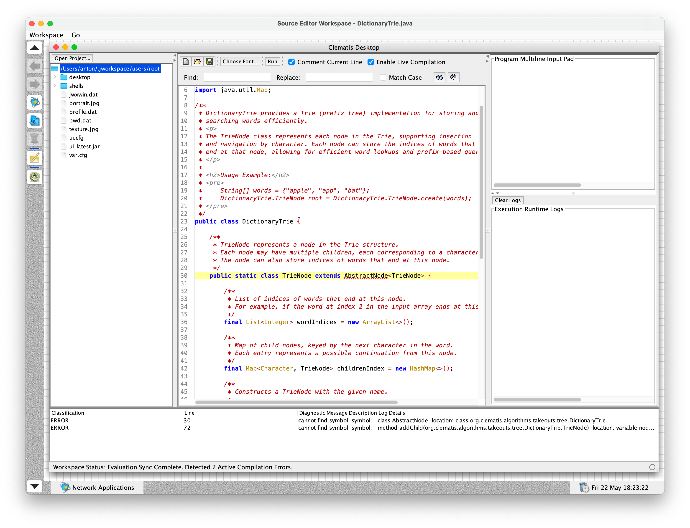

# Code Editor Plugin for Clematis Java Workspace

## Key Features

* Code Editing: Supported by RSyntaxTextArea with Java syntax highlighting, automatic bracket matching, code folding, block-comment toggling (Ctrl + /), and custom line navigation handlers (Home/End keys snap to line boundaries).

* In-Memory Compilation Engine: Utilizes a custom ForwardingJavaFileManager to trap bytecode compilation targets inside ByteArrayOutputStream RAM allocations. No .class files are ever written to your disk.Reflective Zero-Process Execution: Loads and runs code safely off-thread using a custom ClassLoader and reflection via a SwingWorker thread. Bypasses version-mismatch hazards (UnsupportedClassVersionError) caused by system paths.

* Two-Way Interactive Multiline Console: Built-in inputs stream pad captures complex multi-line data payloads (CSV lines, JSON arrays, text block entries) and feeds them seamlessly into the program's standard input channel (System.in).

* Interactive Error Dashboard & Crash Navigation: Displays live background syntax audits alongside real-time intercepted thread crashes. Double-clicking any warning, error, or stack-trace crash line instantly jumps the editor cursor to that exact code segment.

* Decoupled Modular Architecture: Clean separation of concerns using the Mediator design pattern and functional callback listeners (Consumer<Integer>). Highly scalable and easy to maintain.
